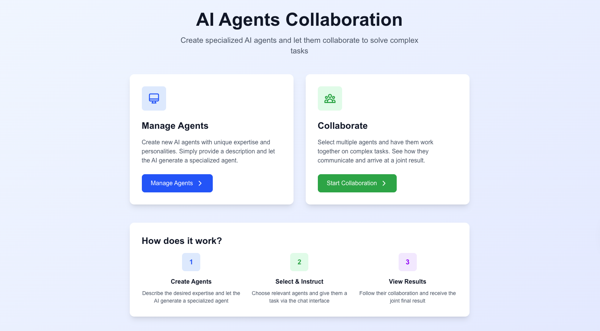

# AI Agents Collaboration

This is a Next.js application that allows you to create specialized AI agents and have them collaborate to solve complex tasks.



## Features

- **Create Custom Agents**: Define agents with unique names, descriptions, expertise, and personalities.
- **Multi-Agent Collaboration**: Select multiple agents to work together on a given task.
- **Streaming UI**: Watch the agents collaborate in real-time through a chat interface.
- **File-Based Storage**: Agents and collaborations are stored as JSON files in the `data` directory.

## Getting Started

### Prerequisites

- Node.js 22+
- npm 
- OpenAI API Key

### Installation

1.  **Clone the repository:**

2.  **Install dependencies:**

    ```bash
    npm install
    ```

3.  **Set up environment variables:**

    Create a `.env.local` file in the root of the project and add your OpenAI API key:

    ```env
    OPENAI_API_KEY=your_openai_api_key_here
    ```

4.  **Run the development server:**

    ```bash
    npm run dev
    ```

    Open [http://localhost:3000](http://localhost:3000) in your browser to see the application.

## How to Use

1.  **Manage Agents**:
    - Navigate to the "Manage Agents" page.
    - Fill out the form to create a new agent by describing its purpose.

2.  **Start a Collaboration**:
    - Go to the "Collaborate" page.
    - Select two or more agents to participate.
    - Give the collaboration a name and description, then start the chat.

3.  **Interact with Agents**:
    - In the chat interface, provide a prompt or task for the agents.
    - The agents will work together, each contributing based on its expertise, to provide a comprehensive solution.

## Project Structure

-   `src/app/`: Next.js App Router pages.
-   `src/components/`: React components for the UI.
-   `src/lib/`: Core application logic.
    -   `actions/`: Server Actions for creating and managing agents and collaborations.
    -   `aiService.ts`: Integration with the OpenAI API.
    -   `fileSystem.ts`: Utilities for reading and writing to the file system.
-   `src/types/`: TypeScript type definitions.
-   `data/`: Stores agent and collaboration data in JSON files.
